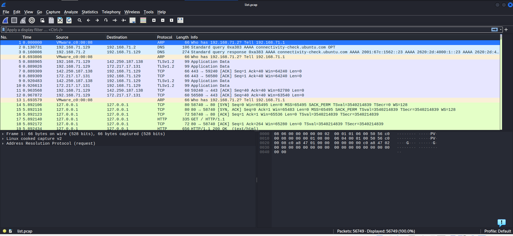
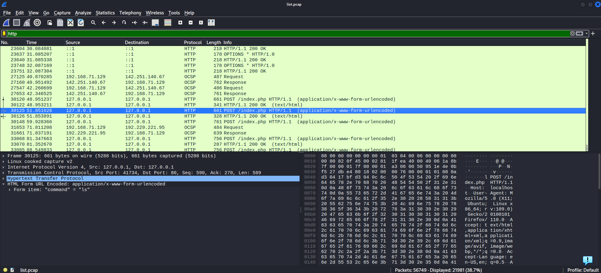

# LIST

This is an easy forensic challenge, but you may need some knowledge about network traffic and wireshark.
You're given a .pcap file and almost nothing in description to guild you.
pcap is a network capture file. You can open it with wireshark and read the network traffic recorded in it.

## Analysis

In a network capture file, there are thousands of packets that will overwhelm a newbie. You can filter out unimportant packets by filtering by protocol,
usually important information are sent/received through HTTP.

By clicking statistic-->protocol hierarchy-->right click on HTTP-->apply as filter-->selected, you can filter out non-HTTP packets.
One may further filter the packets, for example, filtering out 404 error.

Reading through the traffic, I saw an attacker dirbusting the website, and then hacked into the web server quickly.

The hacker was already sending bash commands like ls to the web server, and the server indeed responded with the file names.
After that, the attacker sent a bunch of weird commands, like `echo "ZmluZCAvaG9tZS9jdGYgLXR5cGUgZiAtbmFtZSAiVCIgMj4vZGV2L251bGw=" | base64 -d | bash`.
Because of the = at the end, I guess it is something encoded in base64. Decoding it, I got a character T.

It turns out that the attacker echo-ed character by character the content of the flag. Decoding the strings one by one, I got the solution:
TFCCTF{b4s3_64_isnt_that_g00d}
