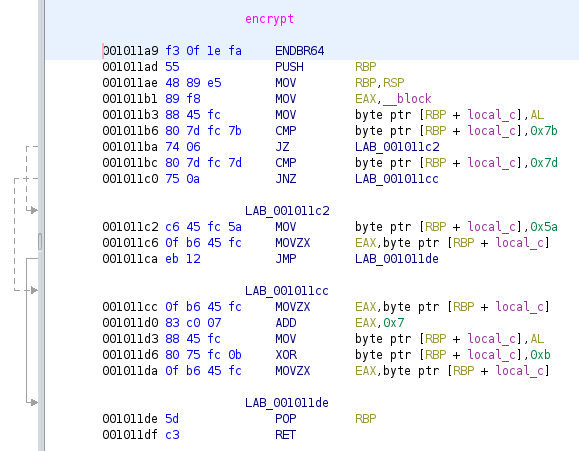

# PASS

This is the warmup reverse challenge. But it may be quite difficult for beginners. We're given a binary executable that takes an input, if the input the the correct flag,
it says correct.

## Analysis

First thing to do is, of course, fire up the decompiler and decompile it. (I use ghidra)

```
void main(void)

{
  char character;
  char *input_pointer;
  long in_FS_OFFSET;
  uint i;
  char buffer [40];
  undefined8 local_10;
  
  local_10 = *(undefined8 *)(in_FS_OFFSET + 0x28);
  set_flag();
  fgets(buffer,0x1b,stdin);
  input_pointer = buffer;
  printf("Password entered: %s\n");
  i = 0;
  do {
    encrypt((char *)(ulong)(uint)(int)buffer[i],(int)input_pointer);
    if (character != flag[(ulong)i * 0x1a]) {
      puts("Wrong password");
                    /* WARNING: Subroutine does not return */
      exit(0);
    }
    i = increment(i);
  } while (i != 0x19);
  puts("Correct password");
                    /* WARNING: Subroutine does not return */
  exit(0);
}
```

Basically, it takes an input, run encrypt(), and then check each character if it matches with the flag[i * 26], if not, say "Wrong password".
If the all characters of the string matches with flag[i * 26], say "Correct password".

The encrypt function somehow cannot be decompiled properly, and we have to look at the assembly code.



It first loads the input character (__block) into [RBP+local_c], and check if it equals to 0x7b (i.e. "{") or 0x7d (i.e. "}").
If the character is { or }, change it to 0x5a ("Z"), otherwise, encrypt the character as follows  
`newchar = xor(char+0x7, 0xb)`

So to decrypt, just do the following on every character in flag[i*26] for i from 0 to 24:  
`char = xor(newchar, 0xb) - 0x7`

The { and } are easy to spot after decrypting the others.

Flag:
TFCCTF{f0und_th3_p44sv0rd}
