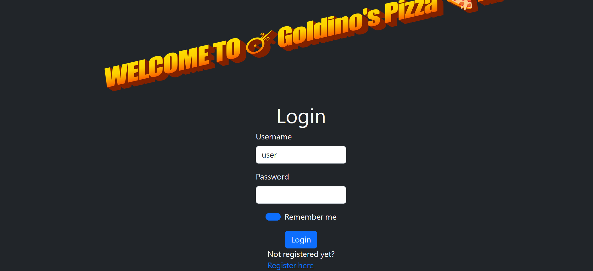
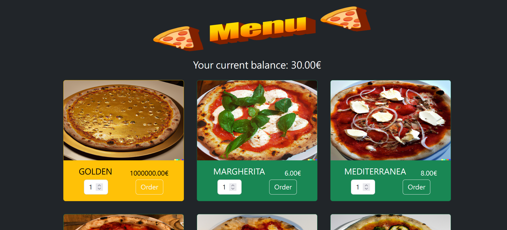
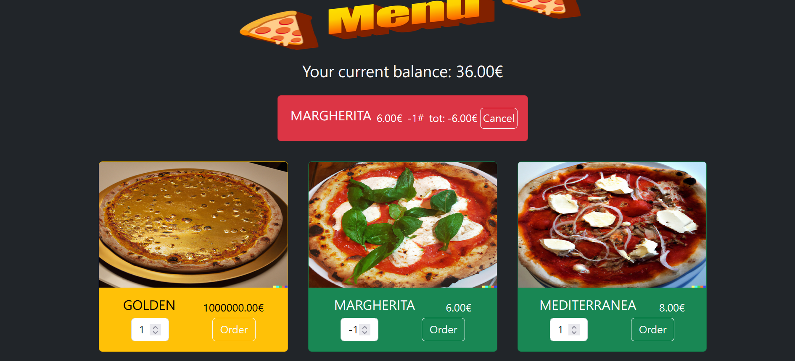

# Goldinospizza (m0lecon Teaser 2023 CTF)
Description - What's for dinner? Free 🍕 is for dinner!  
Category - Web  
Points - 50  
Author - @0000matteo0000  

## TL;DR
Just order negative amount of pizzas to get extra money. Check the WebSocket history using Burp Suite after ordering the golden pizza to get the flag.

## Basic analysis
The Goldinospizza website allows you to login and order pizza.

  

After registering an account, we arrive at the ordering page.



Obviously, we need to buy the golden pizza. But we don't have enough money.
If we order the golden pizza, our balance would drop to negative and a message would pop out, warning us not to steal pizzas.
If we order other pizzas, an order would appear on top of the page with a cancel button.

## Source code analysis
To better understand how the webpage work, I go inspect the source. There are several python files in the folder
```
api.py  auth.py  models  requirements.txt  server.py  static  templates  website.py
```

In `api.py`, I found somthing interesting
```
def order(data, ws, n):
    if "orders" not in data:
        raise AssertionError("NO 🍕 'orders' IN YOUR ORDER")
    if type(data["orders"]) is not list:
        raise AssertionError("NO 🍕 'orders' LIST IN YOUR ORDER")
    if n + len(data["orders"]) > max_requests:
        return len(data["orders"]), None
    for item in data["orders"]:
        if type(item) is not dict:
            db.session.rollback()
            raise AssertionError("ONE OF YOUR 🍕 ORDERS IS NOT AN ORDER")
        if "product" not in item:
            db.session.rollback()
            raise AssertionError("NO 🍕 'product' IN ONE OF YOUR ORDERS")
        if type(item["product"]) is not int:
            db.session.rollback()
            raise AssertionError("ONE OF YOUR 🍕 'product' IDS IS NOT INT")
        if "quantity" not in item:
            db.session.rollback()
            raise AssertionError("NO 🍕 'quantity' IN ONE OF YOUR ORDERS")
        if type(item["quantity"]) is not int:
            db.session.rollback()
            raise AssertionError("ONE OF YOUR 🍕 'quantity' IS NOT INT")
        product = db.session.execute(db.select(Product).filter(
            Product.id == item["product"])).scalars().one_or_none()
        if product is None:
            db.session.rollback()
            raise AssertionError("WE DON'T SELL THAT 🍕")
        quantity = item["quantity"]
        current_user.balance -= product.price * quantity
        if current_user.balance < 0:
            db.session.rollback()
            raise AssertionError("NO 🍕 STEALING ALLOWED!")
        db.session.add(Order(
            user_id=current_user.id,
            product_id=product.id,
            product_quantity=quantity,
            product_price=product.price
        ))
        if product.id == 0 and quantity > 0:
            ws.send(
                f"WOW you are SO rich! Here's a little extra with your golden special 🍕: {os.environ['FLAG']}")
    db.session.add(current_user)
    db.session.commit()
    return len(data["orders"]), {"ok": True, "balance": current_user.balance, "orders": _orders()}
```

So the logic of ordering is, when you order a pizza, your `current_user.balance` decreases by `product.price * quantity`. If the balance drops below 0, the "No stealing allowed" warning pops up, otherwise, you order it succesfully. After that, the flag appears
```
if product.id == 0 and quantity > 0:
    ws.send(
        f"WOW you are SO rich! Here's a little extra with your golden special 🍕: {os.environ['FLAG']}")
```

Here it reveals how to get the flag. If we order the golden pizza but no error is raised, we get the flag.
Therefore, we need to order the golden pizza while not letting the balance drop below 0.

## Solution
First of all, I tried modifying the HTTP requests using Burp Suite and give it some invalid input.  
One of the simplest idea that came to me is: Maybe input a negative number in "quantity"?  
Interestingly, it works


Our balance has increased by ordering a negative amount. So the answer is simple, order something like -10000000000000000 pizzas and then order the golden one. But somehow the flag didn't appear after ordering the golden pizza successfully. So I check everything I received in Burp Suite, and found it in the WebSocket history. Turns out that the flag was sent through WebSocket, and wasn't rendered on the browser.

The flag is not posted here since I didn't write down the flag when I completed it.
