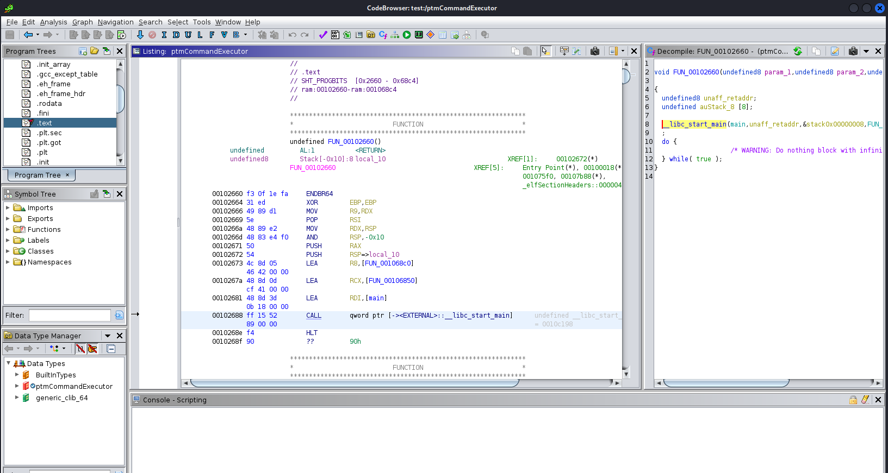

# ptmCommandExecutor (m0lecon Teaser 2023 CTF)
Description - Do I have RCE on this?  
Category - misc  
Points - 72  
Author - @matpro  

This is the second easiest challenges in m0lecon Teaser 2023, but I wasn't able to solve it. Below is what I've learnt after the end of the competition. 

## Basic analysis
The ptmCommandExecutor program asks for command input (3 commands are accepted, including: get_flag, ls, and lp, but access is restricted for get_flag) and executes it.  


## Solution
get_flag\0 (The null byte should be typed in directly)

## My attempt
The solution above is provided by others after the end of the competition, but they didn't create any writeups or explain how they get the solution. So I try to figure it out on my own (spoiler: it wasn't completely successful):

The program is a binary executable, we can use the `file` command to get some basic information about it.
```
ptmCommandExecutor: ELF 64-bit LSB pie executable, x86-64, version 1 (SYSV), dynamically linked, interpreter /lib64/ld-linux-x86-64.so.2, BuildID[sha1]=f685ce785d19af7c66c2297eacd04c771fce437d, for GNU/Linux 3.2.0, stripped
```
`ELF` means it's an executable, `LSB` means little endian is used, `stripped` means debugging symbols are removed, which makes it difficult to debug (e.g. you can't search the main function directly).

I tried commands like ltrace, strace, strings on the binary file, but didn't find anything suspicious. So a full reverse is needed to figure out how the program works.

## Reverse Engineering
I used ghidra, an open-source reverse engineering software to reverse the file.



The first thing to do to reverse a file is to find the main function. Since the debugging symbols are stripped, we would find nothing by searching for 'main'. But for a ELF file, the program code is always stored in the '.text' section, so we can start from there. You can see that in the 'Program Trees' panel in the upper-left corner, those in the panel are headers in the file.

In the middle panel, we have the disassembled code, these are called the assembly code. It's not easy to understand them, but we can focus on the calls and jumps in the assembly code, which outline the structure of the program. Since main is usually the first function called in a program, the first function called here (look at the highlighted line in the image) is usually the main function. But notice that it is not directly calling the main function, but instead calls `__libc_start_main` which takes the address of the main function as a parameter. The 3 instructions before the `call` is loading the parameters, and the last one is the main function (I've renamed it to 'main' for clarity). Click on it, we can inspect the decompiled code on the right panel

```
undefined8 main(void)

{
  time_t tVar1;
  int local_c;
  
  local_c = -1;
  tVar1 = time((time_t *)0x0);
  srand((uint)tVar1);
  FUN_001037ec();
  FUN_00102984();
  while (local_c != 3) {
    local_c = FUN_00103def();
    if (local_c == 3) {
      FUN_001029c8();
    }
    else if (local_c < 4) {
      if (local_c == 1) {
        ExecuteCommand();
      }
      else if (local_c == 2) {
        FUN_00103a78();
      }
    }
  }
  return 0;
}
```
So it takes an input, check whether it is 1, 2, or 3, and then execute something. Obviously we are interested in the `ExecuteCommand()` function (again I've renamed it, so it is not like FUN_00xxxx).

Inspecting the `ExecuteCommand()` function, the most important part I noticed is (Some renaming is done on the variables and functions)
```
    cVar1 = compare_str(input_cmd,"get_flag");
    if (cVar1 != '\0') {
      std::operator<<((basic_ostream *)std::cout,"Admin permission necessary\n");
                    /* WARNING: Subroutine does not return */
      exit(1);
    }
```
The `compare_str` function is complicated, but basically it makes use of the `strcmp` function in C++ library to check whether the strings are equal. If so, it will print out "Admin permission necessary" and kick you out. So the key is to bypass this check so that your command will be executed.

Since C++ strings are not null-terminated, putting in "get_flag\0" will be considered as a different string from "get_flag", allowing you to bypass the check.

## Remarks
I wasn't sure why "get_flag\0" can be executed normally instead of being considered as an unknown command, I am not able to reverse that part as well.  
Probably in the execution part it accepts null-terminated string.  
I guess the important thing is, not all strings are null-terminated.
